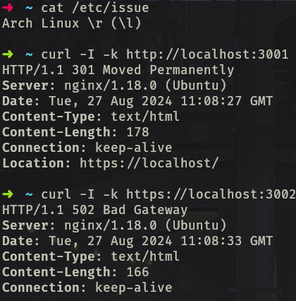

# Тестовое задание

Создал и подключился к виртуальной машине   
   

### 1. Запустите команду ping для проверки сетевого соединения с сервером.   
  
Проверил соеденение с серверов ya.ru и google.com
### 2. Используйте команду curl или wget для проверки доступа к веб-серверу по протоколу HTTP/HTTPS.   
Запрос по протоколу http/https с помощью curl:   
  
Запрос по протоколу http/https с помощью wget:   

так же поднял сервер nginx на виртуальной машине, пробросил порты и получил ответ от своего сервера:   

### 3. Проверьте работу основных служб, таких как SSH, FTP, NFS и других, используя соответствующие команды для каждой службы.
Проверил работу служб SSH FTP NFS:   

Отобразил все остальные службы:   

### 4. Проверьте логи сервера на наличие ошибок и предупреждений, используя команду tail или grep.
с помощью команды tail мы можем увидеть только некоторое количество строк которое мы укажем в параметрах. В данных логах я не нашел никаких ошибок.   

Теперь с помощью команды grep мы можем найти ошибки по всему файлу    

Так же командой `tail -f` мы можем просматривать ошибки в реальном времени
### 5. Выполните базовую проверку производительности системы, используя команды top, htop, vmstat, iostat и другие.
программа top отображает запущенные процессы а так же разнообразную информацию о системе (uptime, memory usage, PID и другие:
  

Программа htop улучшенная версия программы htop с удобным дизайном и некоторыми улучшениями:

vwstat:

iostat программа для отслеживания входных  и выходных:

free программа по отображению информации об оперативной памяти:

df программа отображает все занятость место в разделах файловой системы linux:

sar программа для проверки системы под нагрузкой:

